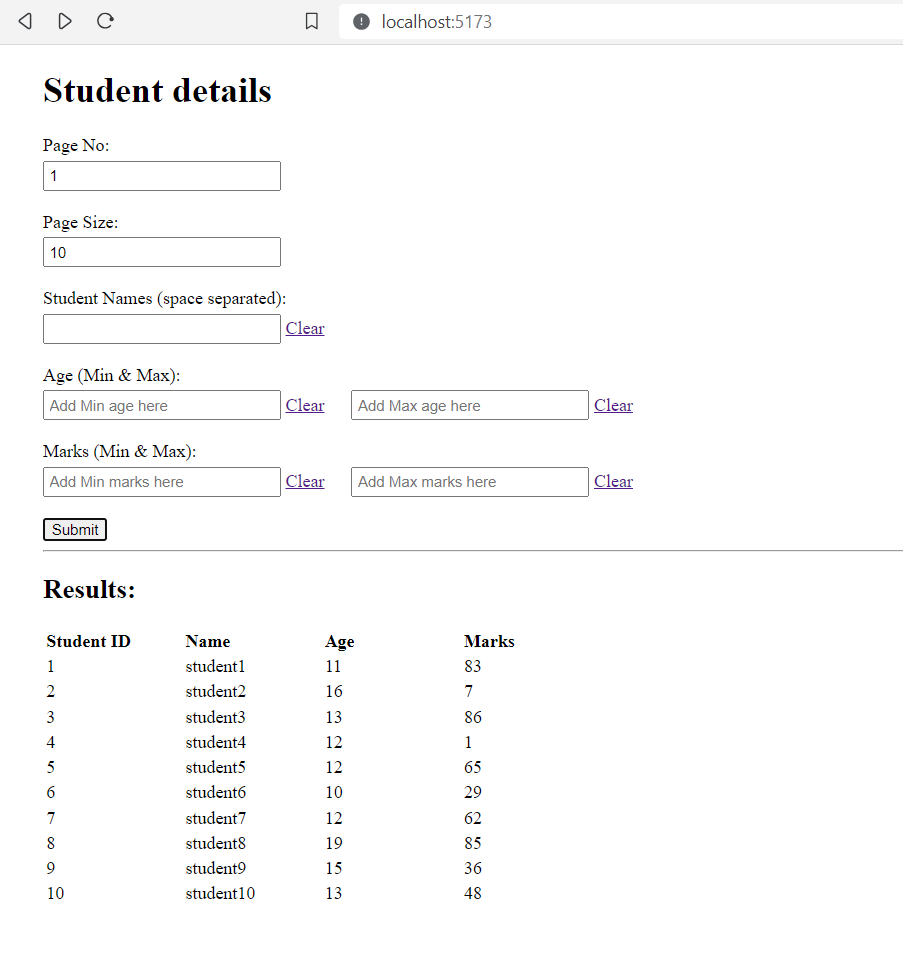
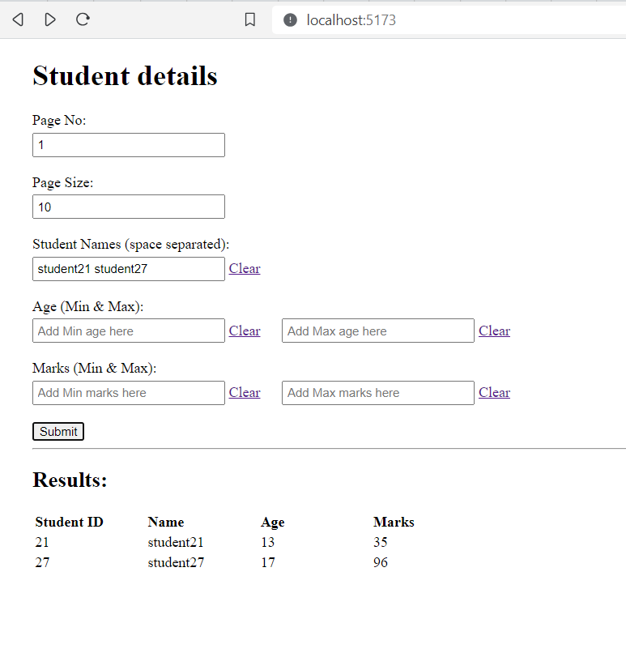
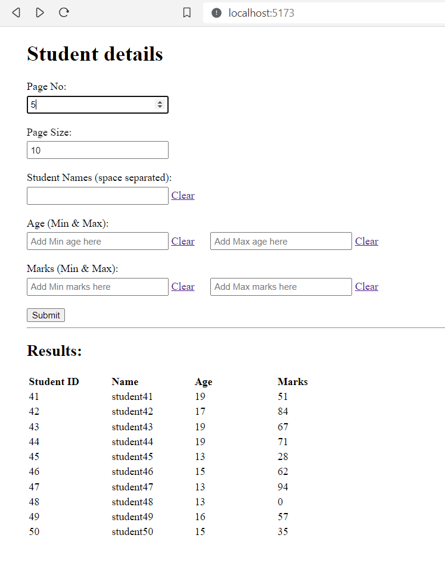
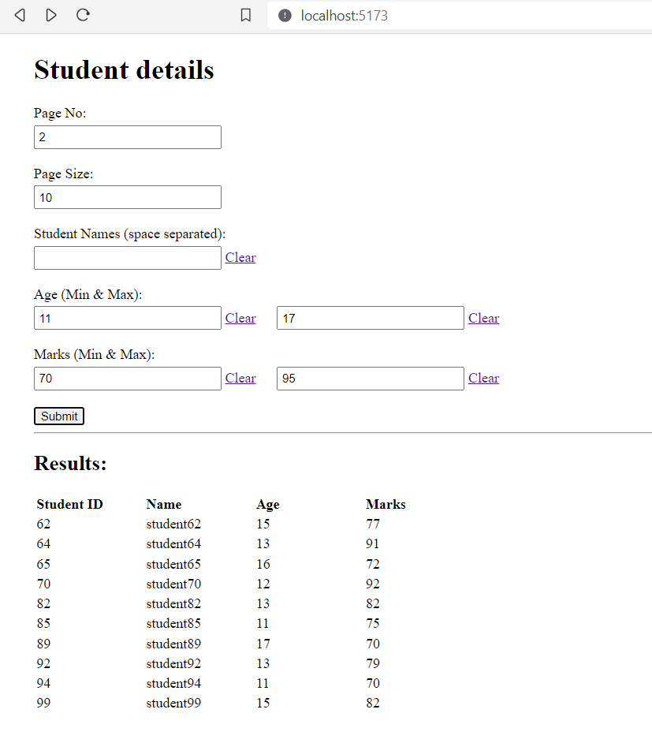

# About

App to fetch student details which are stored in mongodb.

Features:
1. **Pagination -** You can send the page number and page size on backend
2. **Filters -** You can add various filters (student names, min age, max age, min marks, max marks, etc) to fetch details of specific required students.

# Tech

**Backend:** NodeJS + ExpressJS  

**Frontend:** ReactJS (project created using Vite)  

**Database:** MongoDB

# Prerequisites

1. This app assumes that you have installed MongoDB and it is running on port `27017` on your system. If not, then before running this app, please install mongodb and run it on above mentioned port.

2. The mongodb should have dummy data of students in the following format:

```js
{
    id: <number>, // Student ID
    name: <string>, // Student Name
    totalMarks: <number>, // Between 1 to 100
    age: <number> // Between 10 to 20
}
```

To add dummy data in mongodb, I have provided a function in the end of the file `server.js` (function name: `addDummyStudentDetailsInMongoDB`). Run that function once.

# How to run the app

## Steps:

1. Clone this repository on your local system.
2. Run `npm install1` in home directory to install frontend dependencies. 
3. Run `cd server` and then `npm install` to install dependencies of backend.
4. Run `cd ..` to come back to home directory.
5. Run `npm run dev` - this will run both frontend server (on port `5173`) and backend server (on port `3000`)
6. Open `localhost:5173` on your browser.

# Screenshots

Here are some screenshots of the working app

### Screenshot 1


<br/>

### Screenshot 2


<br/>

### Screenshot 3


<br/>

### Screenshot 4



